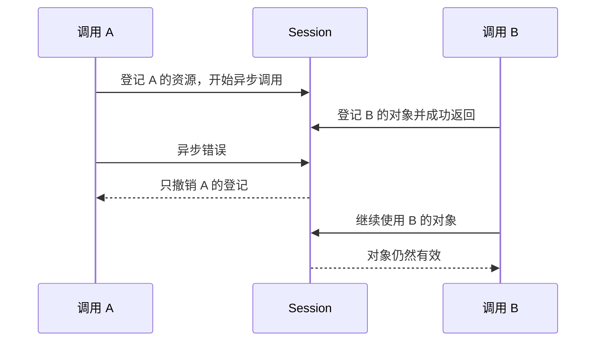

# UniFFI Node 引擎：调用资源归属

每个生成的 Session 可以同时有多个在途调用。一次调用失败只能撤销该调用登记的资源，不能回退整个 Session 到调用开始时的资源表长度；两次异步调用或同步 Host 重入都可能交错登记资源。

`InvocationResources` 显式记录本次新登记的 callback lease、transfer ID、输入流 ID 和对象/输出流身份，参数登记与成功结果登记共用这份清单。异步错误、Promise 拒绝和部分登记失败使用相同回滚路径。

- callback 使用每次保留对应的独立 lease 身份；相同 callback ID 的两次保留不是同一个 token。
- 输入流与 transfer ID 沿用既有单调 ID 和释放标记。
- 对象/输出流使用私有 `Rc` 身份令牌；登记清单保留令牌，不保留原生资源。显式释放后，即使 N-API 复用了 reference 地址，也不会匹配另一份资源。
- Session 仍负责成功调用的最终清理。回滚不会取消其他调用，不改变并发能力，也不跳过失败调用自己的释放。
- 返回值先登记 owned 对象/流，再进入 retained callback 的宿主钩子。钩子失败时，未交付返回值的资源仍能完整回收；重入成功的另一调用使用另一份登记清单。
- 未交付的输出流先取消生产者，再在取消完成后释放。已经在取消中的输出流只标记释放请求，不重复取消或循环强制清空；Session close 等待这段清理。

验证命令：`cargo test -p napi-uniffi-engine --features napi/dyn-symbols`。`addon_runtime` 构建实际 `.node` 插件并在 Node 中执行，覆盖交错成功/错误、Promise 拒绝、同步 Host 重入，以及 close/取消/回调释放。Weft Demo 另以生成的公开 API 运行缺失 socket 的多 Client 并发回归。
